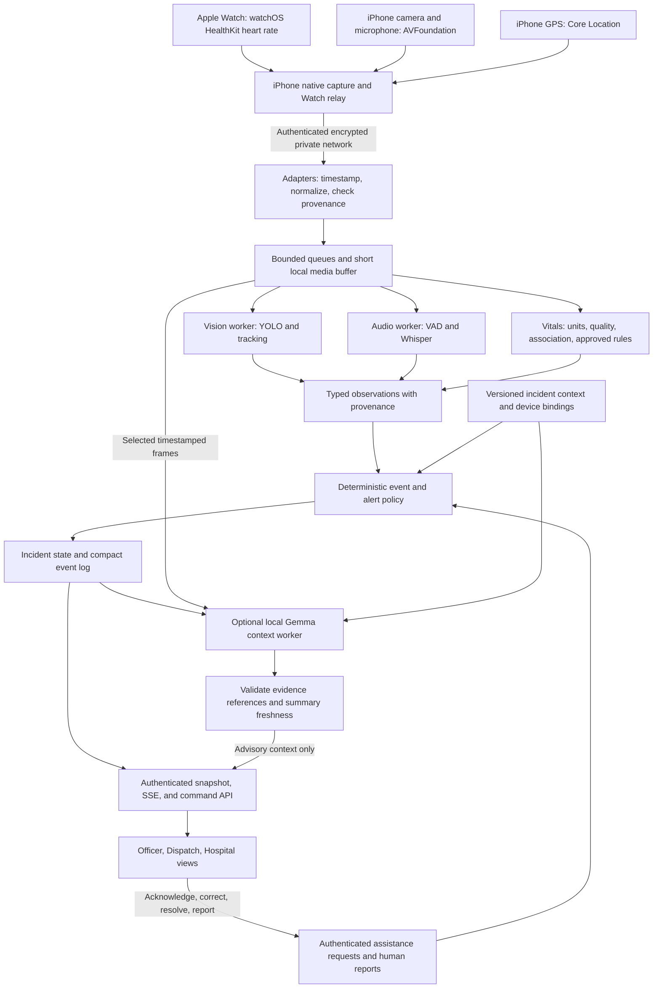

**Local audiovisual and physiological safety pipeline — implementation plan**

Prepared 2026-09-19 for this repository, with the user's specified hardware: Apple Watch for biometrics and iPhone for camera, microphone, and GPS. This is a proposed architecture, not an implemented or validated operational capability. Source documentation was checked during preparation. All latency budgets and capacity estimates below are engineering targets to test on the selected hardware.

Build one local evidence pipeline with independent vision, audio, and physiological processing. A deterministic policy engine produces reviewable advisories; Gemma adds delayed, evidence-linked context. Manual assistance requests have an independent path. Add a thin native iPhone/watchOS capture companion and extend the existing Python service and dashboard. Local inference initially means the existing laptop or vehicle computer reached over a private network; this plan does not assume all models run on the iPhone.

The initial scope is one incident, one local inference host, one iPhone camera/microphone/GPS feed, and one Apple Watch worn by an explicitly enrolled person. Biometrics initially means timestamped heart-rate readings and their availability. Other HealthKit metrics are optional historical or intermittent data, not assumed live channels. A responder's Watch readings are that responder's data, not a patient's readings. Identity and the role of a person come from authorized incident records or a human operator, never facial recognition or behavioral profiling.

**Architecture and deployment boundary.**



Deploy the Swift capture/relay on iPhone and the HealthKit companion on Apple Watch. Deploy the Python service, bounded workers, local SQLite database, and model runner on the existing laptop or a vehicle computer. The existing Next.js app presents the results; the phone companion needs only capture/permission status, connection health, and assistance controls. Separate worker processes or an external model runner provide restart boundaries; separate network microservices are unnecessary. Keep the command handler free of model locks and model admission limits.

A display on the inference host remains available if connectivity to dispatch fails. If the iPhone loses its connection to that host, camera/audio AI coverage stops: the phone must say so, retain only a bounded capture buffer, and show any locally available Watch/GPS data with age. Do not claim offline phone AI with this host-based design. A later on-phone detector can implement the same observation contract if measured offline coverage becomes a requirement. No automatic cloud fallback is needed for the baseline.

**Apple hardware integration and capability limits.**

| Source                 | Concrete adapter                                                                                                                                                                               | Output and limits                                                                                                                                                                          |
| ---------------------- | ---------------------------------------------------------------------------------------------------------------------------------------------------------------------------------------------- | ------------------------------------------------------------------------------------------------------------------------------------------------------------------------------------------ |
| Apple Watch heart rate | Swift watchOS app with HealthKit. During a legitimate user-started supported workout, use `HKWorkoutSession` and `HKLiveWorkoutBuilder`; otherwise use authorized available HealthKit samples. | `heart_rate_bpm`, actual sample interval/time, source/device identity, session mode. Passive collection cadence varies; do not promise 1 Hz updates or uninterrupted delivery.             |
| Watch to iPhone        | Prefer mirrored workout-session data for the active-session path. Use WatchConnectivity instead only if needed for the selected non-workout flow; implement one transport initially.           | Sequenced samples with original measurement time. Delayed transfers remain historical, never current. Do not rely on HealthKit synchronization as a real-time transport.                   |
| iPhone camera          | `AVCaptureSession` and `AVCaptureVideoDataOutput` in a Swift companion.                                                                                                                        | Timestamped frames, orientation/intrinsics when available, dropped-frame counters, interruption state. Foreground capture is the baseline.                                                 |
| iPhone microphone      | AVFoundation/AVAudioSession capture with explicit permission, audio-route and interruption handling.                                                                                           | Timestamped chunks, clipping/route information, gaps. Phone calls and route changes can interrupt recording.                                                                               |
| iPhone GPS             | Core Location updates.                                                                                                                                                                         | Coordinates, original `CLLocation` timestamp, horizontal accuracy, speed/course validity, and permission/availability state. It is the phone's location, not a detected object's location. |
| Device health          | iOS/watchOS lifecycle and power/thermal/session events where APIs expose them.                                                                                                                 | Battery, connection, capture availability, session status. Unknown quality stays unknown; do not manufacture an optical-signal quality score HealthKit did not provide.                    |

Apple documents active workout collection and background watch execution, but a workout session must match the actual user-started activity and supported application purpose; do not manufacture an all-shift workout merely to bypass OS limits. If that mode does not fit the product, expose intermittent available heart-rate data honestly and evaluate dedicated continuous-monitoring hardware separately. [Apple running workout sessions](https://developer.apple.com/documentation/healthkit/running-workout-sessions), [Apple heart-rate measurement behavior](https://support.apple.com/en-us/120277)

For the supported workout path, mirror the session to the iPhone and send encoded heart-rate samples with `sendData(toRemoteWorkoutSession:)`. For a WatchConnectivity implementation, reachable messaging and deferred transfers have different delivery semantics. Keep sequence/sample IDs and original timestamps in either case. HealthKit store synchronization and deferred delivery are backfill mechanisms, not a real-time guarantee. [Apple multidevice workouts](https://developer.apple.com/videos/play/wwdc2023/10023/), [WatchConnectivity](https://developer.apple.com/documentation/watchconnectivity/wcsession)

For a normal iPhone capture application, camera use is interrupted in the background. Native implementation does not make screen-locked, pocketed video capture generally available. Support a mounted foreground phone for the demo, handle interruption callbacks, and visibly stop claiming camera coverage on app switching or lock. Background audio/location require their own supported modes and permissions, and do not grant background camera access. [Apple camera background interruption](https://developer.apple.com/documentation/avfoundation/avcapturesession/interruptionreason/videodevicenotavailableinbackground)

Maintain separate `camera_paused_background`, `audio_interrupted`, `location_unavailable`, and `uploader_disconnected` states. Test an audio session configuration that supports recording and alert playback, handle route changes/calls, and resume camera availability only after fresh frames arrive. Reset tracking continuity after an interruption. Core Location fixes retain their original timestamps, accuracy, and reduced-accuracy state. [Apple audio interruptions](https://developer.apple.com/documentation/avfaudio/handling-audio-interruptions), [Apple background location](https://developer.apple.com/documentation/corelocation/handling-location-updates-in-the-background)

Do not promise continuous blood oxygen, live ECG, numeric blood pressure, or live respiratory rate from the unspecified Watch model. Discover the actual hardware/OS/region and authorized sample types; display optional readings with their original age and source. A HealthKit data type can contain imported or manually entered data, so its presence does not prove the current Watch measured it. Patient BP, oxygen saturation, clinical respiration, and clinical alarm relay require separate measured/reported inputs if later added.

| Optional Watch feature | Why it is outside the live baseline                                                                                                                                                     |
| ---------------------- | --------------------------------------------------------------------------------------------------------------------------------------------------------------------------------------- |
| Blood oxygen           | Model/region dependent, intermittent, and described by Apple as a wellness feature. [Apple Blood Oxygen](https://support.apple.com/en-us/120358)                                        |
| ECG                    | A completed user-initiated recording requiring contact with the Digital Crown, not a continuous responder ECG channel. [Apple ECG](https://support.apple.com/en-us/120278)              |
| Respiratory rate       | Apple's documented sleep feature does not establish current breathing rate at an incident. [Apple sleep measurements](https://support.apple.com/en-am/guide/watch/apd830528336/watchos) |
| Blood pressure         | Hypertension notifications are not systolic/diastolic cuff measurements. [Apple hypertension notifications](https://support.apple.com/en-la/117296)                                     |

Request the minimum HealthKit types and camera/microphone/location permissions, explain the selected incident destination, and associate the Watch with its consenting wearer. Protect tokens in platform secure storage. Handle denied/revoked access and no available samples without substituting demo values; HealthKit privacy may not reveal whether absent read data means denied access. Keep native Apple safety features independent. The application's assistance button is an incident-team request and must not imply it invokes Apple Emergency SOS or emergency services. [HealthKit authorization semantics](https://developer.apple.com/documentation/healthkit/hkauthorizationstatus)

**What can be reused, and what actually needs changing.**

| Current implementation                                                           | Required change                                                                                                                                                                                   |
| -------------------------------------------------------------------------------- | ------------------------------------------------------------------------------------------------------------------------------------------------------------------------------------------------- |
| `services/triage/triage/providers.py`: interchangeable YOLO and vision providers | Reuse interfaces and provenance; add a separately validated domain detector checkpoint.                                                                                                           |
| `pipeline.py`: YOLO completes before a VLM assessment is returned                | Publish detector observations immediately; run contextual assessment asynchronously. Current default provider timeout is 90 seconds.                                                              |
| `app.py`: visual and audio requests share one admission gate                     | Introduce bounded independent vision/audio/context workers and a reserved control/sensor path.                                                                                                    |
| `transcription.py`: optional local faster-whisper                                | Preserve timestamped hypotheses; move to bounded short audio segments for live use.                                                                                                               |
| `schemas.py` and exported JSON schemas                                           | Generate TypeScript types and runtime validators from the canonical schemas. The current frontend uses `bbox: number[]`, while the backend returns `{x1,y1,x2,y2}`.                               |
| `store.py`: SQLite visual result and retry records                               | Extend with incident snapshots, event revisions, source assignments, and attributable operator actions. It is not currently an evidence-media store.                                              |
| Root `/capture` and `/api/triage`, `/api/transcribe` proxies                     | Keep as development/replay entry points; add authenticated live ingestion and streaming. Current capture waits for inference and then another two seconds. Audio uses finalized ten-second clips. |
| `features/paw-patrol` Officer, Command, Hospital views                           | Supply shared server state through a live data adapter. Current browsers run independent synthetic sessions.                                                                                      |
| `consult.ts`: scene status, panic, and MIST data                                 | Replace scripted clearance, local acknowledgments, and synthetic readings in live mode with authenticated events and measured/reported fields.                                                    |
| Root Traccar bridge                                                              | Reuse capture-time freshness semantics. A fresh server receipt does not make an old location fix current.                                                                                         |

Preserve the existing `/v1/triage` and `/v1/transcribe` contracts during migration. The proposed live contract is `/v2`, so the current demo does not silently receive new semantics. Do not route the new live workers through the existing shared admission gate.

**Concrete component contracts.**

| Component                   | Input                                                                              | Output                                                              | Required behavior                                                                                                                                                |
| --------------------------- | ---------------------------------------------------------------------------------- | ------------------------------------------------------------------- | ---------------------------------------------------------------------------------------------------------------------------------------------------------------- |
| Hardware adapter            | iPhone frame/audio/GPS packets and relayed Watch HealthKit samples                 | `Frame`, `AudioChunk`, `VitalSample`, `LocationFix`, `SourceHealth` | Capture timestamps, sequence/boot IDs, declared clock uncertainty, explicit source assignment, limits, disconnect events.                                        |
| Ingest and scheduler        | Typed packets and authenticated source                                             | Normalized samples and bounded work items                           | Keep the latest unprocessed video frame per source; retain a bounded audio window with explicit gaps. Reserve capacity for SOS and device alarms.                |
| Vision worker               | Normalized frame plus orientation/transform metadata                               | `ObjectObservation[]`, camera-relative tracks, visibility quality   | Detect, associate across adjacent frames, retain evidence crops/full-frame reference. No identity or intent inference.                                           |
| Audio worker                | Timestamped audio                                                                  | `TranscriptSegment[]`; optional `AcousticObservation[]`             | Separate speech recognition from environmental sound detection; preserve uncertain words, overlap, and missing audio.                                            |
| Vitals worker               | Assigned Watch readings, units, available provenance/quality, sample/session state | `VitalObservation[]`, `SensorFault[]`                               | Validate units and association, retain consumer-device provenance, and use only approved review rules. Clinical-device alarm relay is a separate future adapter. |
| Policy and incident reducer | Observations, approved context, operator commands                                  | `AlertEvent[]` and authoritative `IncidentSnapshot`                 | Deterministic priority, deduplication, freshness, acknowledgment, corrections, and human scene reports.                                                          |
| Gemma context worker        | Bounded snapshot, selected evidence, provisional transcript, allowed context       | `ContextSummary`                                                    | Evidence-linked statements, unknowns, and timestamps; cannot modify alerts, bindings, scene clearance, or clinical records.                                      |
| API and frontend adapter    | Snapshot and ordered event deltas                                                  | Existing role-specific panels                                       | Schema validation, authorization, reconnect/replay, stale-state display, and explicit command outcomes.                                                          |

These are module boundaries. Only the hardware interface, backend API, and model runner need transport boundaries initially.

**Local model selection.**

Use YOLO26n as the existing integration baseline; compare a small variant only if representative tests show better event detection within the latency budget. Standard COCO weights contain a knife category but no firearm category. Guns, smoke/fire, and operationally meaningful obstruction or person-down events need suitable task data, trained heads/checkpoints, temporal rules, and separate validation. A generic label must not be advertised as a validated capability. [Official COCO class list](https://docs.ultralytics.com/datasets/detect/coco/)

Start with one domain-trained detector covering the supported object classes where feasible. Use ByteTrack or the existing runtime's supported tracker for short-lived camera-local continuity. Disable appearance-based re-identification initially. A track is an uncertain visual association, not a person's identity; reset it across source restarts and preserve association ambiguity. Repeated frames and two models looking at the same image do not count as independent confirmation. [Ultralytics tracking](https://docs.ultralytics.com/modes/track/)

Retain faster-whisper `base` with CPU INT8 as a first speech baseline because the service already supports it. Test `small` only if siren/radio/accent and numerical-transcription accuracy justify the compute. Run speech activity detection before ASR, normalize the working stream to 16 kHz mono, and keep original timestamps. Use roughly 1–3-second processing windows with overlap and stable segment IDs; these are chunked inference, not a claim that Whisper natively supplies reliable streaming. Evaluate duplicate text, clipped words, and dropped negation. [faster-whisper implementation](https://github.com/SYSTRAN/faster-whisper)

If environmental audio alerts are required, add a separate, feature-flagged YAMNet-based classifier with domain evaluation. YAMNet is a general environmental sound model, not a certified gunshot detector. An impulse/siren hypothesis cannot identify a weapon or its location. A single microphone does not provide reliable direction finding. Keep this extension out of the first release unless sound-event detection is actually in scope. [TensorFlow YAMNet](https://www.tensorflow.org/tutorials/audio/transfer_learning_audio)

Use a pinned Gemma 4 model for optional image/text context. Evaluate `gemma4:e4b` or a supported quantized E2B/E4B artifact on the selected host; retain the existing `gemma4:26b` only if concurrent-load measurements support it. Google documents native audio for E2B/E4B/12B, while 26B is text/image. Model-level audio capability does not establish that the selected Ollama build exposes a usable audio interface, so keep the separate ASR path. [Gemma 4 model card](https://ai.google.dev/gemma/docs/core/model_card_4)

The default Ollama tags currently list approximately 7.2 GB for E2B, 9.6 GB for E4B, and 19 GB for 26B. These are artifact sizes, not full inference memory requirements; different quantizations differ. The 26B model's active parameter count is not its total memory footprint. Pin model digests, runtime versions, quantization, image preprocessing, and prompt/policy versions. Validate license obligations for the actual code and weights before distribution. [Ollama tags](https://ollama.com/library/gemma4/tags), [Gemma deployment guidance](https://ai.google.dev/gemma/docs/core), [Ultralytics licensing](https://www.ultralytics.com/license)

**Inference host and scheduling.**

Use the existing laptop first; no Jetson is required by the specified phone/Watch setup. A 32 GB unified-memory laptop, or a Linux host with 32 GB system RAM and a GPU with at least 16 GB VRAM, is a reasonable profiling baseline for a compact Gemma variant plus the other workloads; it is not a performance guarantee or a required purchase. Reduce or disable Gemma on a smaller host. Memory must include the OS, decoder, image encoder, runtime workspaces, ASR, buffers, and context cache. Start with one iPhone before claiming multi-camera capacity.

| Path                      | Initial engineering target                                                     | Overload behavior                                                                                              |
| ------------------------- | ------------------------------------------------------------------------------ | -------------------------------------------------------------------------------------------------------------- |
| Manual assistance request | Host arrival-to-render p95 ≤250 ms; separately measure phone-to-host delay     | Reserved bounded path; durable command acknowledgment where storage is healthy; explicit failure otherwise.    |
| Visual advisory           | Capture-to-render p95 ≤500 ms and p99 ≤1 s in the supported operating envelope | Reduce admitted sources/rate; discard superseded frames; expose reduced coverage.                              |
| Detector cadence          | Start profiling at 5–10 analyzed frames/s/source                               | Validate minimum object visibility duration; lower cadence may miss briefly exposed objects.                   |
| Speech                    | Stable text p95 ≤2 s after utterance end                                       | Bound backlog and mark omitted segments; manual requests remain independent.                                   |
| Watch heart rate          | Process each delivered sample; host arrival-to-render p95 ≤250 ms              | Separately display measurement age and transfer delay. This does not promise Watch sampling/transport latency. |
| Context                   | On a material change, initially at most once per 3–5 s                         | One pending latest snapshot; suppress stale responses and fall back to templates.                              |

Measure latency including capture, transport, decode, queues, inference, policy, event publication, and rendering. Separate packet arrival latency from physiological measurement age. Freeze the tested number of sources, resolution, cadence, and ambient/thermal conditions as the supported operating envelope.

Scheduling priority is manual assistance, sensor health/vitals, visual observations, ASR, then context. Future clinical-device alarms would join the reserved control path. Independent Python queues alone do not guarantee GPU isolation. Test VLM prefill and cancellation under load; if the runtime cannot reclaim resources sufficiently, disable shared-device context inference during live monitoring. An HTTP timeout must not leave unlimited model work running in the background. Use bounded processes, watchdogs, and tested restart behavior. Preload approved local artifacts before a shift; do not download models on a live request.

**Shared input, evidence, and output schema.**

Every sample carries schema version, incident/source IDs, sequence and boot ID, capture time, receipt time, source monotonic time where available, and clock uncertainty. Monotonic clocks are comparable only within their own clock domain. Record clock-offset estimates and drift; refuse precise cross-device associations when uncertainty exceeds the configured event window.

Source registration records transport, capabilities, supported units, firmware, cadence, and the operator-approved device assignment. Patient/responder assignment is effective-dated and versioned: late samples retain the binding that applied when measured. Never attach sensor readings to whichever face happens to appear on screen.

Observations add kind, evidence IDs, model/sensor provenance, raw score if present, quality, and the event-time interval. Coordinates are normalized `{x1,y1,x2,y2}` in the orientation-corrected frame, with source dimensions, frame ID, and transform metadata. Media uses opaque evidence IDs, not arbitrary client URLs. Authenticate and authorize evidence fetches.

Keep three public contracts:

- `Observation`: what a sensor, model, or human reported, including uncertainty and source.
- `AlertEvent`: the policy's request for attention, including evidence and disposition.
- `IncidentSnapshot`: current role-authorized state at a monotonically increasing revision.

An illustrative alert payload, with invented IDs and values:

```json
{
  "schema_version": "2.0",
  "event_id": "evt-104",
  "incident_id": "incident-demo",
  "revision": 104,
  "kind": "possible_visible_weapon",
  "priority": "urgent_review",
  "claim": "Possible knife-like object in camera view",
  "source_id": "camera-02",
  "subject_id": null,
  "track_id": "camera-02:boot-7:track-18",
  "observed_at": "2026-09-19T20:00:00.000Z",
  "received_at": "2026-09-19T20:00:00.080Z",
  "last_seen_at": "2026-09-19T20:00:00.200Z",
  "fresh_until": "2026-09-19T20:00:02.200Z",
  "clock_uncertainty_ms": 25,
  "bbox": { "x1": 0.55, "y1": 0.42, "x2": 0.67, "y2": 0.66 },
  "coordinate_space": "normalized_oriented_frame",
  "evidence_refs": ["frame-819", "crop-819-1"],
  "model_score": 0.74,
  "score_semantics": "uncalibrated_model_score",
  "quality": { "visibility": "partial", "sensor_state": "available" },
  "evidence_status": "machine_observed",
  "attention": "unacknowledged",
  "disposition": "open",
  "policy_version": "scene-review-v2",
  "model_ref": "detector-build-example",
  "requires_human_review": true
}
```

The two-second freshness interval is illustrative, not a universal threshold. Expiration changes presentation to stale; it does not resolve an open hazard. `0.74` is not a 74% chance that someone is dangerous. Keep model score, evidence quality, operational priority, and human review separate.

A `VitalSample` additionally requires a metric, value, canonical unit, original unit/value, device quality flags, association version, and measurement interval. Use `null` with a reason for unavailable values; never use zero for missing heart rate or SpO2. A cuff reading remains an intermittent measurement with its age, not a continuously updated blood pressure.

**Minimal external API.**

| Proposed interface                 | Request / response                                                                                                                                                            |
| ---------------------------------- | ----------------------------------------------------------------------------------------------------------------------------------------------------------------------------- |
| `POST /v2/ingest/media`            | Multipart typed manifest and binary frame/audio chunk → accepted sequence, admission result, explicit rejection/drop reason. Hardware uses a source-scoped credential.        |
| `POST /v2/ingest/telemetry`        | Bounded Watch samples, GPS fixes, and source-health batch → accepted sequences and errors. Future clinical alarm adapters would receive reserved capacity.                    |
| `GET /v2/incidents/{id}/state`     | Authorized snapshot with revision, source health, alerts, vitals, context freshness, and human scene report.                                                                  |
| `GET /v2/incidents/{id}/events`    | Server-sent events with durable cursor and heartbeat. A cursor outside retained history requires a new snapshot.                                                              |
| `POST /v2/incidents/{id}/commands` | Discriminated command: request assistance, acknowledge, reject, resolve, report scene status, update assignment, or submit handoff. Actor identity comes from authentication. |
| `GET /v2/evidence/{id}`            | Authorized crop/clip/metadata, or explicit unavailable/expired result; access is audited.                                                                                     |

Use idempotency keys for retriable writes. Include the expected revision for commands whose meaning depends on current state, especially assignment and clearance. A database transaction appends the event and updates the snapshot. Publish only committed revisions; client replay deduplicates event IDs. Reconnect must not replay an expired event with a fresh urgent sound.

SSE carries compact state/events, not raw video or base64 frames. Begin with timestamped evidence thumbnails. Add WebRTC only if live video viewing is a real requirement; inference and event contracts remain unchanged. Foreground browser capture is a useful immediate demo input, but real Watch integration needs the native companion, and neither browser nor the baseline native app can promise unrestricted background camera use.

**Context wrapping without an agent framework.**

Construct a small, typed `ContextBundle` from incident ID, viewing role, assigned sources, effective subject bindings, capture-time window, sensor quality, recent verified human reports, active event IDs, relevant map accuracy, and versioned approved protocol identifiers. Separate privileged policy/configuration from untrusted operator notes, transcripts, and text visible in frames. Only authorized operators may change incident bindings or reports.

Give Gemma a bounded snapshot, selected timestamped frames/crops, relevant transcript segments, and an allowlist of evidence IDs. Require structured output containing `snapshot_revision`, `statements` with evidence references, `unknowns`, `conflicts`, and `generated_at`. Ollama supports schema-constrained output, but valid JSON does not establish that a statement is supported by evidence. Validate references, numerical fields, timestamps, and permitted claims; unsupported content is suppressed or retained only as a separately marked unverified note for human review. [Ollama structured outputs](https://docs.ollama.com/capabilities/structured-outputs)

The model has no tools that send alerts, alter device configuration, resolve incidents, change patient bindings, or authorize scene entry. A slow response carries its original snapshot revision; discard it if the incident has materially changed. Template summaries remain available when the VLM is absent. Avoid vector databases or full-history prompts: the required context is already in the typed incident state.

**Safety behavior for the actual use cases.**

| Situation                      | Appropriate output                                                                       | Required boundary                                                                                                        |
| ------------------------------ | ---------------------------------------------------------------------------------------- | ------------------------------------------------------------------------------------------------------------------------ |
| Potential gun or knife         | “Possible firearm/knife-like object,” frame/crop, camera, time, visibility, human review | No inferred criminal intent, guilt, threat score, or force recommendation. No claim of possession from a simple overlap. |
| Officer equipment visible      | Preserve the observation; allow attributable correction/annotation                       | Do not suppress a possible weapon merely because clothing resembles a uniform.                                           |
| Person down / movement change  | Observable posture or device-reported fall, with uncertain association                   | No automatic diagnosis, intoxication claim, or violence prediction.                                                      |
| Smoke, traffic, blocked access | Specific observed cue and location within the camera view                                | No electrical energization, structural integrity, toxicity, or safe-route claim from appearance alone.                   |
| Speech mentioning a gun        | Timestamped tentative transcript or human report                                         | Speech is a report, not visual confirmation; preserve negation and access to original audio.                             |
| Gunshot-like acoustic event    | Unconfirmed sound-event hypothesis, time and source                                      | No automatic identification of shooter, direction, or precise location.                                                  |
| Abnormal or changing vitals    | Measured value, trend, age, quality, source alarm, relevant approved review rule         | No diagnosis/dosing or replacing monitor alarms; consumer readings remain identified as such.                            |
| Low-quality extreme reading    | “Check patient and sensor,” show available value and quality                             | Do not silently erase a concerning reading as an artifact or fabricate a corrected value.                                |
| EMS access                     | Attributable human scene report with scope, time, expiry, and revocation                 | Model output and absent detections cannot authorize entry. New conflicting evidence visibly requires reassessment.       |
| Medical handoff                | Structured MIST draft with each field linked to measured data or human report            | Unknown stays “not reported”; a human reviews and submits any external handoff.                                          |

For any later clinical-sensor extension, physiological evaluation must account for the connected device's limitations. FDA identifies pulse-oximeter accuracy concerns involving circulation, skin pigmentation, temperature, and other conditions. Preserve device flags and evaluate the intended use population; do not infer skin-based “corrections” from video. Do not estimate oxygen saturation, blood pressure, pain, stress, intent, or truthfulness from an ordinary camera or microphone. [FDA pulse oximeters](https://www.fda.gov/medical-devices/products-and-medical-procedures/pulse-oximeters)

Keep alert dimensions distinct: evidence status (`machine_observed`, `human_confirmed`, `human_rejected`), attention (`unacknowledged`, `acknowledged`), disposition (`open`, `human_resolved`), and freshness (`fresh`, `stale`, `unavailable`). Acknowledgment is receipt, not agreement or resolution. A disappearance from view is “no longer observed,” not “hazard removed.”

Use class-specific persistence and hysteresis to reduce flicker, but test brief exposures explicitly. Do not require a fixed number of frames for all hazards: that could suppress a briefly visible weapon. An eligible high-consequence single-frame detection may produce an immediate unconfirmed review advisory; subsequent evidence updates the same event. Human rejection is scoped to the evidence/track and must not suppress future unrelated detections.

Clinical thresholds, durations, escalation rules, and stale limits are configuration owned by the relevant clinical lead and sensor specifications. Do not invent universal medical cutoffs in the application. Existing medical-device alarms operate independently and cannot be muted by this software.

**Frontend integration and human interaction.**

Add a `useIncident` adapter supplying the existing panels from validated snapshot/event data. Keep a separate explicit `demo` adapter for `useScenario`; never silently replace missing real data with synthetic readings. The three workspace servers must subscribe to the same incident backend, so acknowledgments and reports synchronize. UI role selection and port numbers do not grant access; server authorization controls each projection and command.

| Existing view      | Live presentation                                                                                                                                                                                                 |
| ------------------ | ----------------------------------------------------------------------------------------------------------------------------------------------------------------------------------------------------------------- |
| Officer            | Compact attention queue, evidence thumbnail, source/time, camera/mic/connection health, manual SOS, and acknowledgment. Avoid constant narration and repeated alarms for the same event.                          |
| Dispatch / Command | Unit locations with age/accuracy, source availability, shared incident timeline, human scene reports, assignments, and pending acknowledgments. Camera source location is not the detected object's map location. |
| Hospital / EMS     | Assigned patient measurements and trends, measurement age/quality, native alarm provenance, and editable MIST draft. Do not expose unrelated officer/private patient data.                                        |
| Anatomy view       | Display human-entered or otherwise validated anatomical findings with provenance. A 2D detection does not establish a 3D injury location.                                                                         |

Evidence overlays must match the exact analyzed frame or a validated tracking transform. Do not draw a delayed box on unrelated current video. Use camera-relative language unless calibrated geometry supports world coordinates. Display current, stale, unavailable, and simulated states with text/icons as well as color. Support gloved interaction and concise audible/haptic alerts without obscuring native device alarms; validate these choices with intended users.

**Failure handling, security, and data limits.**

| Failure                                                                | Required response                                                                                                                                                                                                                                            |
| ---------------------------------------------------------------------- | ------------------------------------------------------------------------------------------------------------------------------------------------------------------------------------------------------------------------------------------------------------ |
| Camera dark, covered, disconnected, or phone backgrounded              | Visible source-health degradation and limited coverage; no safe/clear scene output.                                                                                                                                                                          |
| Wrong patient assignment, device reboot, sequence gap, timestamp drift | Reject unsafe association, expose the problem, retain attributable correction; do not move old samples into the new patient's record.                                                                                                                        |
| ASR loses “no” in “no gun,” or hallucinates during sirens              | Keep transcript tentative; no urgent weapon policy from free text alone.                                                                                                                                                                                     |
| Gemma times out, emits invalid JSON, or follows text in an image       | Reject output; alerts continue from policy and measurements. Media content never enters the control plane.                                                                                                                                                   |
| GPU overheat, queue growth, memory pressure                            | Shed context first, then reduce optional work; report reduced coverage and enforce configured source limits.                                                                                                                                                 |
| Network partition                                                      | Host-to-dispatch failure preserves host operation. Phone-to-host failure explicitly stops AI coverage for that source while the phone retains available local sensor status. Reconnect deduplicates events and does not present old observations as current. |
| Disk full or database failure                                          | Preserve native device alarms and local fallback warning; do not claim actions were durably acknowledged. Expose audit/storage failure.                                                                                                                      |
| Service restart                                                        | Restore unresolved events as historical/stale until fresh evidence arrives; show the monitoring gap and reset camera-local track epoch.                                                                                                                      |

Use authenticated source credentials, operator sign-in, role/incident-scoped authorization, encrypted transport off-host, and restricted local model/API listeners. The repository's current bearer-token service protection does not authenticate users of its Next.js proxy. Block cross-incident evidence access and reject forged device identity, malformed payloads, excessive media, and unsupported schema versions.

Use a short bounded RAM media buffer for inference and event context; persist event-associated crops/clips only under the deployment's explicit retention policy. Configure deletion, encrypted storage, evidence-access audit, and any required preservation workflow before field use. Do not log raw patient audio, frames, or credentials. Retain minimal event provenance, model digests, and operator decisions. A SQLite log with hashes is not automatically a forensic chain-of-custody system; do not claim it is.

**Implementation order and exit criteria.**

1. **Contracts and replay.** Generate frontend types/validators from the Python schema; fix bounding boxes. Add typed source health, telemetry, event revisions, and a deterministic recorded/synthetic replay adapter. Exit: all three views consume the same replay incident, with attribution and explicit demo labeling.
2. **Fast visual evidence and shared state.** Split YOLO from VLM completion, add bounded worker scheduling, incident reducer, SQLite event/snapshot transactions, SSE, and operator commands. Exit: an eligible detector event reaches all views while Gemma is deliberately hung; acknowledgment is synchronized and does not resolve the event.
3. **Apple capture and physiology.** Add one Swift iPhone capture app and watchOS companion; connect camera/mic/GPS and available HealthKit heart-rate samples from the enrolled wearer. Normalize timestamps, provenance, and available quality. Exit: watch off-wrist/locked/charging, low power, watch disconnect, phone lock, app switching, calls, denied access, competing or ended workout session, reboot, drift, stale data, and storage failure behave as specified. No synthetic fallback in live mode.
4. **Audio and context.** Add bounded ASR with segment provenance, then event-triggered Gemma summaries. Environmental sound detection remains separately gated. Exit: transcript errors, unsupported model claims, prompt injection, and stale model responses cannot change alert or clearance state.
5. **Domain evaluation and supervised pilot.** Train/evaluate supported hazard classes, measure complete pipeline performance and operator workload, then use shadow mode with responders/clinicians. Exit: predetermined acceptance criteria pass on held-out representative data and target hardware; operational owners approve the intended scope.

Meaningful tests include contract round trips, event replay/idempotency, out-of-order packets, conflicting human commands, cross-role access, binding history, state transitions, stale rendering, model timeouts, and resource exhaustion. They should verify observable outcomes, not mirror helper implementations.

**High standards: evidence required before operational reliance.**

Freeze the operating envelope: camera placement, lighting, object size/range, visibility duration, motion, audio environment, device models, number of streams, and hardware/thermal profile. Build a dataset with phones/tools/toys/medical scissors and responder equipment as hard negatives; include occlusion, nighttime, rain, sirens, radio overlap, accents, and packet loss. Split by incident, recording session, wearer, and location so adjacent frames cannot leak between training and evaluation.

Measure per-class event recall, missed events, false advisories per camera-hour, time to first advisory, track association errors, and operator acknowledgment workload. Report confidence intervals and sample counts. For audio, include critical-word/negation and numerical errors, not only average word error rate. For physiology, evaluate quality handling, unit conversion, association accuracy, freshness, and preservation of device alarms. Measure performance across relevant conditions and populations rather than relying on an overall average.

Set acceptable miss rates and false-alert rates with intended operators before final evaluation. A demo score or mAP result is not a safety release criterion. Require fault injection, usability review, a shadow-mode pilot, documented residual limitations, and rollback. Re-evaluate after changing weights, thresholds, quantization, camera mounting, sensor firmware, or model runtime. The NIST AI RMF is a useful voluntary process framework, not product certification. [NIST AI RMF](https://www.nist.gov/itl/ai-risk-management-framework)

The first working slice should be one iPhone camera/microphone/GPS source, one assigned Apple Watch heart-rate source, one local inference host, one incident, shared role views, an independent assistance path, a validated detector path, and optional evidence-grounded summaries. Patient monitor integration is a later optional adapter. Add Kafka, Kubernetes, vector search, autonomous agent orchestration, cross-camera identification, or a replacement dashboard only if a later demonstrated requirement warrants them.
