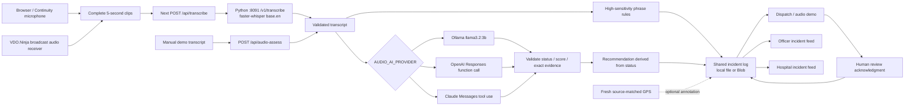

# Audio-first AI integration and demo runbook

The working path is **microphone → local Whisper → contextual LLM assessment → shared incident → dispatcher review**. It runs on this laptop without a cloud key. The local default is the already-installed `llama3.2:3b`. OpenAI and Claude use the same assessment contract through server-side adapters.

The main **Camera & audio** broadcast panel also connects VDO.Ninja audio to this pipeline: select its reporting source and click **Analyze broadcast audio**. This works with a direct iPhone Safari broadcaster or a Mac publisher using the iPhone's Continuity microphone. `/audio` is only the optional testing interface. Continuity capture started directly from the existing capture controls uses the same endpoint. Native v2 capture and the map-only `/join` flow remain separate.

**High-sensitivity review is now independent of the LLM.** Immediately after transcription, phrase rules publish an urgent alert for bomb/explosion/shooting language and a review alert for weapon/distress language. They run even when the AI provider is disabled, unavailable or disagrees. Rules have no confidence score and intentionally trigger on quoted, negated or training language; only a person acknowledges them. The contextual AI answer remains visible separately. Pending phrase and urgent model alerts no longer expire from the map after two minutes; timestamps remain visible, and the bounded 200-event log/reset still limits retention.

## What the architecture review found

| Source                                                    | Existing connection                                                                          | Connection to AI / dispatch now                                                                                                                                          |
| --------------------------------------------------------- | -------------------------------------------------------------------------------------------- | ------------------------------------------------------------------------------------------------------------------------------------------------------------------------ |
| Browser / Continuity microphone                           | `useAudioTranscription` → `/api/transcribe` → Python `/v1/transcribe`                        | **Connected:** Whisper → semantic assessment → `/api/incidents` → all demo workspaces. Previously this only matched words.                                               |
| Manually entered transcript                               | New `/api/audio-assess`                                                                      | **Connected:** same model, validation and publication; labelled manual demo input. Useful when microphone hardware is unavailable.                                       |
| Browser camera                                            | `/api/triage` → YOLO / vision model → `publishCapture`; `/api/streams` relay; WebRTC viewing | Existing route publishes visual observations when configured. Video is not an input to the new audio reasoning.                                                          |
| Browser/phone GPS                                         | `/api/positions` and Traccar → `/api/live-position` → map                                    | Fresh, time-matched Blob-backed GPS optionally annotates audio incidents by exact source ID. GPS is not sent to the LLM. Without GPS/Blob, audio works without location. |
| Browser Bluetooth heart rate                              | `useHeartRate` → panels; explicit vitals publication in `SituationPanel`                     | Displays readings. No automatic threat or injury inference from BPM. Not an input to audio reasoning.                                                                    |
| Native iPhone microphone/camera/GPS and Apple Watch       | Python `/v2/ingest/media` and `/v2/ingest/telemetry` → SQLite → `LiveWorkspace`              | **Separate backend/UI mode.** Native v2 media does not pass through `/api/transcribe` and does not automatically invoke the new assessment.                              |
| Simulated officers, injuries, routes and ambulance motion | `scenario.ts`, local reducers                                                                | Remain simulated; AI does not start the scripted injury or claim a real unit was sent.                                                                                   |
| Dispatch feedback                                         | Shared append-only incident log                                                              | **Connected:** structured assessment and `audio_review` acknowledgment cross processes. No emergency-service integration or automatic dispatch.                          |

There are two incident systems: the dashboard's shared log and authenticated v2 SQLite/SSE. `PAW_PATROL_DATA_MODE=live` selects the latter and does not merge their events. For this demo, use default `demo` mode with real audio input. Older descriptions of an entirely disconnected frontend were stale.



## Run it

Configured on this machine: Ollama, English Whisper, `.env.local`, and speech service on 8091. Dashboards use 5176/5177/5178. The synthetic v2 service on 8090 remains separate.

Fresh setup (requires Node, pnpm, uv and Ollama):

```sh
ollama pull llama3.2:3b
pnpm setup:audio
pnpm dev:audio
```

`setup:audio` installs locked speech dependencies, downloads `base.en`, generates a server token and fills missing or blank `.env.local` settings without overwriting configured values. It selects `PAW_PATROL_INCIDENT_STORE=local`, fixing the missing-Blob failure locally. Check retained values if another provider/storage was already configured. Speech uses a separate SQLite file with YOLO disabled.

If dashboards are already running, use **`pnpm dev:speech`** to avoid port conflicts. Next reloads `.env.local`; restart dashboards if settings are not reflected. `dev:audio` starts speech and all three dashboards. Stop with Ctrl+C.

1. Open [Officer audio](http://localhost:5177/audio) and [Dispatch audio](http://localhost:5176/audio). Dispatch also embeds Audio intelligence below its inference panel.
2. Set the officer's reporting source, such as `officer-P-01`. Click **Start microphone only** and grant permission. No camera is required.
3. Speak a fictional demo line: “There is a bomb in my car. It is going to explode.” Wait for the complete 5-second clip, speech recognition and the 1.5-second polling interval. The phrase alert publishes before contextual AI completes. Keep capture visible: capture stops when its tab is hidden.
4. Dispatch shows transcript, status, confidence, exact evidence, uncertainty, provider, latency and recommendation. **Acknowledge review** writes a shared event. It does not dispatch units or change the separate assistance/panic state.
5. Compare **Routine speech** and **Quoted training** using manual controls. They invoke the real LLM. Training quotations containing dangerous words still produce a clearly labelled phrase-review alert, even if the contextual model returns `no_threat_detected`.
6. Stop the microphone when finished. A phone needs a reachable HTTPS origin; localhost on a phone refers to that phone.

The recorder continues making complete clips during inference and queues up to eight waiting clips. If processing cannot keep up, the oldest queued clips are dropped and a persistent coverage-gap warning is shown. Upload failures are also surfaced. This is not guaranteed continuous coverage; use one active analysis receiver for the deadline. The provisioned model is English; multilingual transcription requires another checkpoint.

## Concrete API contract

`GET /api/audio-assess` reports configured provider/model, speech settings and storage. “Configured” is not a live health check.

`POST /api/audio-assess` accepts up to 4,000 characters, a source ID and optional recent `captured_at`. This entry is always labelled **manual**; callers cannot claim microphone provenance. Empty, malformed, oversized and stale input fails before inference.

```json
{
  "source_id": "officer-P-01",
  "text": "Officer, I have a gun and I will shoot you. Stay back."
}
```

Example response shape; scores and text depend on the model:

```json
{
  "function": "report_audio_assessment",
  "assessment": {
    "status": "urgent_threat",
    "confidence": 0.92,
    "summary": "The transcript contains an explicit threat of shooting.",
    "evidence": ["I will shoot you"],
    "uncertainty": "Speaker identity and transcription are unverified.",
    "recommended_action": "urgent_backup_review",
    "provider": "ollama",
    "model": "llama3.2:3b",
    "latency_ms": 1100,
    "transcript": "Officer, I have a gun and I will shoot you. Stay back.",
    "input_kind": "manual"
  },
  "publication": "published",
  "dispatch_executed": false
}
```

Successful publication also returns the incident `event` with ID/sequence. Repeated publication of identical source, timestamp and transcript is deduplicated. Storage failures return `publication: "failed"` alongside the assessment.

Responses also include `safety_alert` (a separate phrase-rule incident or `null`) and `safety_publication`. If the LLM fails after an alert was saved, the endpoint returns that alert with `assessment: null` and `ai_error`; it never invents a successful AI result. Microphone uploads expose the independent result as `X-Audio-Safety-Alert`. Alert records correlate to later AI context by `assessment_id` and retain exact phrase evidence.

| Model status         | Server recommendation                                 |
| -------------------- | ----------------------------------------------------- |
| `no_threat_detected` | `monitor` — this clip does not establish scene safety |
| `uncertain`          | `contact_officer`                                     |
| `potential_threat`   | `review_for_backup`                                   |
| `urgent_threat`      | `urgent_backup_review`                                |

OpenAI/Claude are asked to call `report_audio_assessment`; the application validates and records the arguments. Ollama returns the same fields through schema-constrained output. The model has no dispatch tool. Evidence must occur in the input transcript; threat classifications need supporting evidence. Application code derives recommendations from status instead of accepting arbitrary commands.

The model is explicitly instructed to flag present bomb/explosive reports as urgent and current weapon-possession claims as needing review, while preserving negation and clearly historical/training context. It must not infer tone from text. As a conservative demo rule, a `no_threat_detected` result below 0.6 confidence recommends `contact_officer` and is displayed as needing clarification; the original model status and score remain in the API record. This threshold is not a calibrated safety guarantee. Low confidence never downgrades a reported urgent threat.

`POST /api/transcribe` retains its existing JSON contract. Added headers are `X-Audio-Assessment` and `X-Incident-Publication`; the complete result is in the event's `audioAssessment`. Semantic failures preserve transcription, show an error in capture, and retain the explicitly labelled phrase-match fallback. Language-detection confidence is no longer shown as threat confidence.

## Switch providers

Set these only on the server, then restart/reload Next. Speech remains local; only transcript text reaches a cloud provider. No extra SDK is needed.

```dotenv
# OpenAI
AUDIO_AI_PROVIDER=openai
AUDIO_AI_MODEL=gpt-4.1-mini
OPENAI_API_KEY=<server-secret>
```

```dotenv
# Claude: use a model enabled for your account that supports forced tool use.
AUDIO_AI_PROVIDER=anthropic
AUDIO_AI_MODEL=<your-claude-model-id>
ANTHROPIC_API_KEY=<server-secret>
```

Unset `AUDIO_AI_BASE_URL` when changing providers unless deliberately using a custom endpoint. Defaults use OpenAI `/v1/responses`, Anthropic `/v1/messages` and Ollama `/api/chat`. Cloud mode sends no GPS, pulse or video. Keys never reach the browser. Adapters follow [OpenAI function calling](https://developers.openai.com/api/docs/guides/function-calling), [Claude tool definitions](https://platform.claude.com/docs/en/agents-and-tools/tool-use/define-tools) and [Ollama structured output](https://docs.ollama.com/capabilities/structured-outputs). Cloud calls still need verification with account credentials.

## Limits and troubleshooting

- **Feed disconnected:** inspect `/api/audio-assess`. `.runtime/incidents.json` is shared across processes on one host. Hosted multi-instance deployments still need Blob; local mode is refused on Vercel.
- **Speech unavailable:** keep `pnpm dev:speech` running; `TRIAGE_URL` must point to 8091 with the matching token. Port 8090 may be the synthetic v2 service.
- **AI unavailable:** Ollama must be running and contain `AUDIO_AI_MODEL`. Provider failures never produce “no threat.”
- **Interrupted local write:** a crash can leave `.runtime/incidents.lock`. Stop demo servers and remove that empty directory before restarting. Lock contention times out without overwriting another writer.
- The log keeps 200 events and persists across restarts. Reset clears it. Phrase alerts and urgent AI reports remain pending until acknowledged or evicted from the bounded log. Other map audio alerts age out after two minutes; a later neutral clip does not resolve an earlier threat automatically.
- The existing app passphrase gate covers the new route. The demo incident API does not provide per-officer authorization; scoped authorization belongs to the separate v2 system.
- Scores are self-reported and uncalibrated. Noise, overlap, context and speaker attribution remain limitations. This is an assistance demo, not a validated threat detector.

## Verification

TypeScript and targeted lint passed for the audio integration, including `CapturePanel` after incorporating the QR-code effect and hook fixes from `main`. Live checks covered browser assessment and review acknowledgment, a generated synthetic WAV through Officer HTTP → real Whisper → real Ollama → shared dispatch incident, and setup with blank environment placeholders. Review exposed incorrect bomb/knife classifications in the original local prompt; after tightening the instructions, eight manual demo phrases returned the intended classifications (bomb, imminent explosion, knife, knife with warning, negated knife, historical training, direct threat and routine speech). These examples are a smoke check, not a validated accuracy evaluation.

No tests were added or suite run, per hackathon instructions. Cloud credentials, physical microphone hardware, native v2 integration, video fusion and external dispatch were not verified by those checks.

The high-sensitivity follow-up was exercised with generated speech published through VDO.Ninja WebRTC, received by the main dashboard, decoded and recorded in the browser, sent through real Whisper/Ollama, and shown as eight urgent phrase alerts with eight AI assessments. The same alerts and one acknowledgment were verified on ports 5176, 5177 and 5178. The captured text included “the bomb is going to explode.” A quoted-training sample retained an urgent phrase-review alert despite the LLM returning `no_threat_detected`; a routine location query produced no phrase alert. Direct WAV ingestion through the Officer route also returned urgent phrase and model results. These are synthetic integration checks; actual iPhone/Continuity capture and venue-network reliability still need a hardware demo check. Stopping analysis stopped capture while leaving pending reports visible.
