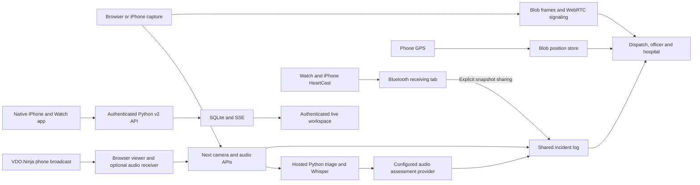

# Deployment and workflow audit — 2026-09-20

Target: https://hackmit2026-iota.vercel.app/

**Verdict: the deployed dashboard renders and reads its shared stores, but the
complete real-device workflow is not operationally verified. Camera/audio AI is
currently unconfigured on the deployment.** Local model and native-backend checks
passed separately; they do not establish that those services are reachable from
Vercel or that physical devices work at the venue.

Production checks used anonymous reads and empty, non-publishing media requests.
No production incident, position, frame, acknowledgment, or deployment setting was
changed. Generated speech and review actions used separate local production server
processes with temporary incident storage.

## Observed deployment state

| Workflow                                 | Evidence                                                                                                                  | Result                                                       |
| ---------------------------------------- | ------------------------------------------------------------------------------------------------------------------------- | ------------------------------------------------------------ |
| Dispatch and map                         | `/dispatch` rendered its Mapbox map; browser reload had no page errors or failed HTTP responses in the observation window | Working UI; patrols are simulated                            |
| Hospital, phone join, capture diagnostic | `/hospital`, `/join`, `/capture/check` rendered in Chrome                                                                 | Working entry points; no hardware permission granted         |
| Officer access                           | Anonymous `/officer` redirected to `/sign-in`; sign-in page rendered                                                      | Gate present; actual officer login not exercised             |
| Shared incident reads                    | `/api/incidents` returned 200; UI showed shared feed connected                                                            | Reads work; production write/retry/concurrency not exercised |
| GPS and frame storage reads              | `/api/live-position` returned `no-devices`; `/api/streams` returned 200 with zero frames                                  | Readable stores, no active hardware to verify                |
| Audio AI                                 | `/api/audio-assess`: provider `disabled`, configured `false`                                                              | **Blocked by deployment configuration**                      |
| Speech and camera inference              | Empty POSTs to `/api/transcribe` and `/api/triage`: 503 `not-configured`, requiring `TRIAGE_URL` and `TRIAGE_API_TOKEN`   | **Blocked by deployment configuration**                      |
| Built-in WebRTC relay                    | `/api/webrtc/ice`: `relay: false`, one STUN server                                                                        | TURN unavailable; cross-network connections unverified       |
| Native live workspace                    | Deployment shows the demo dashboards                                                                                      | Separate native pipeline not verified on this deployment     |

## Architecture that actually exists

These paths are not interchangeable:

- Dashboard observations use `/api/incidents`. Local multi-process demos can
  share a file; deployed instances use private Blob storage. Camera frames,
  signaling and GPS need their own Blob-backed paths even when incidents use a
  local file.
- Continuous HeartCast data stays in the paired browser tab. The operator can
  explicitly publish a current snapshot. It does not stream Watch BPM to another
  computer or populate native v2 telemetry automatically.
- HeartCast's timeout measures **notification age**, not the Watch's measurement
  age. No-contact, zero/invalid packets and disconnect clear immediately; silence
  expires after 3 seconds. If HeartCast keeps rebroadcasting an old nonzero value
  without a no-contact flag, this protocol cannot identify it as an old sample.
- `useDemoHandoff` uses a hidden iframe/browser relay. Animated ambulance missions
  synchronize within the same browser context, not across independent devices.
  Shared operator reports and native MIST records use different mechanisms.
- Native capture uses enrolled sources, authenticated telemetry/media ingestion,
  SQLite, role-filtered state and SSE. `PAW_PATROL_DATA_MODE=live` selects this
  workspace. The dashboard audio assessment path is not automatically part of it.
- The main VDO.Ninja broadcast and the built-in Blob-signaled WebRTC transport are
  separate. Missing `PAW_PATROL_TURN_*` settings concern the built-in transport;
  they do not establish whether VDO.Ninja's relay works.

## Items blocking a real-device sign-off

1. **Connect the hosted inference backend.** Configure an HTTPS service reachable
   from Vercel, its `TRIAGE_API_TOKEN`, and the Python speech/vision providers.
   A laptop's `127.0.0.1:8091` is not reachable from a Vercel function. Choose and
   configure `AUDIO_AI_PROVIDER` and its model/credentials separately. The current
   laptop audio launcher disables vision; it is not proof of working camera AI.
2. **Decide which state must cross devices.** HeartCast live BPM and animated
   ambulance missions do not currently provide that transport. Use explicit
   reviewed snapshots/reports where sufficient; continuous remote telemetry and
   real multi-device mission coordination require an appropriate shared service.
3. **Protect real-device records.** Anonymous production requests currently read
   incident records and media/position indexes. Officer sign-in does not provide
   role authorization for those demo APIs; callers supply their source IDs. Set
   the existing shared passphrase gate for a private demonstration, or use the
   scoped native backend for enforced operator/source separation. A shared gate
   alone does not establish officer identity or per-source write permissions.
4. **Qualify phone transport on the actual network.** Configure TURN if using the
   built-in peer transport across restrictive Wi-Fi/cellular. Verify video and
   audio with the real iPhone, then reload/reconnect. VDO.Ninja needs its own
   publisher/viewer check. HTTPS alone does not establish successful streaming.
5. **Complete hardware and human-review checks.** Verify Watch removal, phone
   foreground/background behavior, GPS identity, independent receiving browsers,
   signal freshness and recovery. Native iOS/watchOS SDK compilation needs full
   Xcode; this machine currently selects Command Line Tools only.

The isolated speech check included an explicitly stated training exercise. Phrase
rules intentionally requested urgent review, and the local model also classified
it as urgent. This demonstrates the transport but also a contextual false positive;
it does not establish reliable classification or calibrated confidence.

## Fixes made during this audit

- `/dispatch`, `/officer` and `/hospital` previously ignored native live mode and
  always rendered demo dashboards. All four main entry points now use the same
  mode validation and render the authenticated live workspace when selected.
  The backend session, not the URL, determines the live operator's permissions.
- The local incident store's dynamic filesystem path caused production tracing
  to include a developer runtime incident file and unrelated assets. Runtime
  storage is now excluded from that static path trace, and `.runtime/` is excluded
  from Docker build context. The audio route trace dropped from 617 to 110 files,
  with zero runtime data files or public models in that trace after rebuilding.
- Root setup, container comments and HeartCast notes now describe shared storage,
  explicit snapshot sharing and the current 3-second timeout accurately.

The fixes were verified locally; deployment rollout was not part of this audit.
They do not configure the hosted inference service, enable TURN, or add continuous
cross-device HeartCast/mission transport.

## Verification completed

- `pnpm run typecheck`, project-wide `pnpm run lint`, changed-code lint and
  production builds passed. The broad tracing warning disappeared after the fix.
- The generated Python/TypeScript contracts passed
  `.venv/bin/python -m scripts.export_contracts --check` from `services/triage`.
- The existing isolated native HTTP/SSE smoke passed all 10 checks: telemetry,
  event replay, assistance idempotency, dispatch acknowledgment, hospital biometric
  isolation, patient-scoped MIST, unavailable inference, restart durability and cleanup.
- Actual generated WAV → Next `/api/transcribe` → local Whisper → Ollama →
  phrase/model incident publication returned 200. Two separate production server
  processes read matching IDs/sequences from the temporary shared log.
- The second server's browser displayed the alert; acknowledgment removed it from
  the pending list and produced `audio_review` in the original server's log.
- With live mode enabled, `/`, `/dispatch`, `/officer` and `/hospital` all returned
  the operator sign-in UI without a demo clock. The hospital page was also checked
  in the browser.
- Production pages and read APIs were checked as listed above; empty media
  requests confirmed the missing backend configuration without publishing data.

No tests were written or test suite run under `AGENTS.md` hackathon mode. Existing
heart-rate test expectations for the old timeout remain unchanged. Physical
iPhone/Watch behavior, production writes, TURN/VDO cross-network media, native
browser authentication/SSE against a hosted backend, model accuracy and sustained
load remain unverified.

## Acceptance sequence after configuration

Use explicitly marked demo sources and an approved test incident. Keep existing
production records intact.

1. Sign in on an iPhone and separate receiving browsers; verify expected access.
2. Publish phone GPS, camera and speech; confirm the exact source and capture time
   on Dispatch and Hospital. Check video separately from still frames.
3. Exercise one reviewable phrase, observe the shared alert, acknowledge it on
   Dispatch and confirm the same acknowledgment on another device.
4. Connect HeartCast in supported desktop Chrome; remove the Watch and record what
   notifications HeartCast actually emits. Confirm no-contact versus silent versus
   repeated-value behavior, then reconnect and switch the assigned profile.
5. Share a vitals snapshot and a reviewed MIST report. Verify source attribution,
   patient/profile selection, and the intended receiving workspace.
6. Disconnect networking, background the phone and reload a viewer. Confirm clear
   unavailable/stale states, recovery, and no substitution of simulated data.
7. If native v2 is the intended path, repeat with the signed iPhone/Watch apps,
   enrolled sources, distinct operator roles and the hosted SSE gateway. This is
   a separate qualification from the browser demo.
