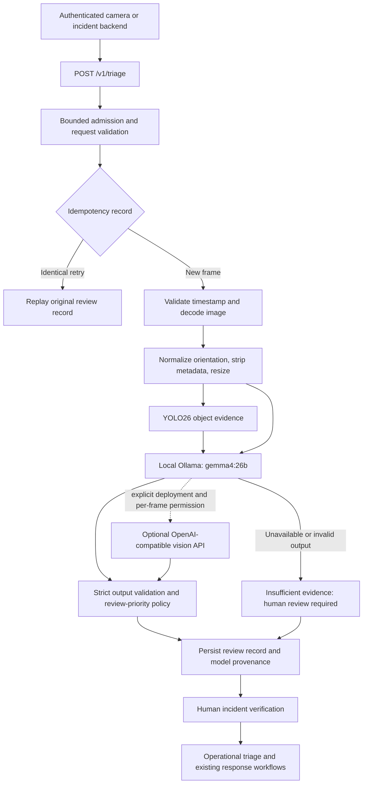

# Visual hazard triage

The new `services/triage` Python service supplies **advisory visual evidence** for
the ingestion, incident verification, and operational triage stages in the
architecture diagram. The existing Next.js map is unchanged. Dispatch,
notifications, clinical decisions, camera ingestion, and a reviewer UI are not
implemented by this service.



## Local setup

Use **Python 3.13**, [uv](https://docs.astral.sh/uv/), and native
[Ollama](https://docs.ollama.com/). The committed `uv.lock` resolves the entire
Python dependency graph. YOLO is an optional install extra, so tests do not need
model downloads or GPU hardware.

```bash
cd services/triage
uv sync --locked --extra yolo
cp .env.example .env
python3 -c 'import secrets; print(secrets.token_urlsafe(32))'
```

Put the generated value in `TRIAGE_API_TOKEN` in `.env`. Keep it in server-side
configuration. Do not put this token or a provider key in `NEXT_PUBLIC_` variables
or send it to a browser. Startup rejects missing or short tokens.

The installed model on the development laptop was verified as `gemma4:26b`, with
vision capability and Q4_K_M quantization. Check the actual installation:

```bash
ollama list
ollama show gemma4:26b
```

If another machine does not have the model, provision it explicitly with
`ollama pull gemma4:26b`. Vision model downloads are never triggered by request
handling. The optional audio transcription model loads on first use; see the root
README to provision a local Whisper model directory ahead of requests.
Native Ollama uses the Mac's GPU; Ollama in Docker Desktop on macOS does not have
GPU passthrough. See [Ollama's FAQ](https://docs.ollama.com/faq).

Provision the small YOLO26 detector and record its checksum:

```bash
uv run --no-sync python -m scripts.prepare_yolo
```

Copy the printed `TRIAGE_YOLO_SHA256` into `.env`. The service only loads an existing
configured weights file and verifies the checksum when configured. Use trusted
weights: PyTorch model files are executable artifacts, not ordinary image data.
For a deliberate vision-only deployment, set `TRIAGE_YOLO_ENABLED=false`.
The default device is CPU; a tested native Mac installation can select `mps`.
Linux and Windows use CPU PyTorch wheels from the explicit official PyTorch index;
macOS uses its native wheels. A CUDA deployment needs a separate GPU dependency
lock and runtime configuration. This follows [uv's PyTorch guidance](https://docs.astral.sh/uv/guides/integration/pytorch/).

Start one worker:

```bash
uv run --no-sync uvicorn triage.app:create_app --factory \
  --host 127.0.0.1 --port 8090 --workers 1 --no-access-log
```

The map still starts separately from the repository root with `pnpm run dev`.
The optional `/capture` page calls a Next.js `/api/triage` proxy using the server's
`TRIAGE_URL` and `TRIAGE_API_TOKEN`; see the root README for setup. The dashboard
has no user login, so enabling this proxy grants submission access to everyone
who can reach it. Use a trusted LAN or authenticated reverse proxy. A production
incident backend must enforce user, tenant, and incident authorization separately
from this service credential.

## Submit an image

Supply a JPEG, PNG, or WebP and its **actual timezone-aware capture time**. The
default maximum age is five minutes. Future timestamps more than 30 seconds ahead
are rejected. A successful identical idempotent retry may replay after that window.

```bash
uv run --no-sync python -m scripts.submit_frame /absolute/path/frame.jpg \
  --source-id camera-01 \
  --incident-id incident-001 \
  --captured-at 2026-09-19T17:00:00-04:00 \
  --idempotency-key frame-001
```

Replace the example timestamp with the frame's capture time. Use a new key for
each new frame. Reusing a key with different input returns a conflict. The CLI
prints the result but not the token or image bytes; its output can still contain
sensitive scene descriptions. A timeout can be retried with the same key and
identical payload while the record remains within retention.

`POST /v1/triage` accepts JSON with `image_base64`, `media_type`, `source_id`,
`captured_at`, optional `incident_id`, and `allow_cloud` (default `false`). It
requires `Authorization: Bearer ...` and `Idempotency-Key`. Images are supplied as
bytes encoded in base64; the service never fetches client-provided image URLs.
Versioned request/result JSON schemas are committed under
`services/triage/contracts`. Regenerate them with
`uv run --no-sync python -m scripts.export_contracts`; CI checks for drift.

| HTTP status     | Meaning                                                     |
| --------------- | ----------------------------------------------------------- |
| 200             | Review record, including insufficient-evidence results      |
| 400 / 415 / 422 | Invalid protocol, unsupported media, or invalid/stale frame |
| 401             | Missing or incorrect service token                          |
| 408             | Request body did not arrive within its deadline             |
| 409             | Idempotency key conflicts or is currently in progress       |
| 413             | Request exceeds the byte limit                              |
| 429             | All inference slots are occupied; retry with the same key   |
| 503             | Service or result storage unavailable/full                  |

The response separates:

- `detections`: YOLO labels, scores, and normalized bounding boxes on the
  orientation-corrected image, with coordinates between zero and one.
- `assessment`: visual hazard categories, severity, self-reported confidence,
  visible evidence, uncertainty, and indices of any supporting detections.
- `review_priority`: deterministic human review urgency, independent of confidence.
- `status`, `warnings`, `models`, `timings_ms`, image hash, and prompt/policy versions.
- `requires_human_review: true` and `confidence_semantics: uncalibrated_model_scores`.

Critical hazards request immediate review; high severity requests urgent review.
Low confidence never downgrades a potentially severe hazard. If no vision assessment
is available, or image quality is inadequate without a high/critical hazard proposal,
the result requests review for insufficient evidence. Authorized fallback can recover
from a local provider failure. Empty detections or an empty hazard list never
establish that a scene is safe.

## Confidence and model limitations

YOLO's object score and a vision model's self-reported confidence measure different
things. They are not averaged or represented as a calibrated probability of harm.
Standard COCO-trained weights do not have explicit classes for many hazards such
as smoke, fire, or downed wires. Every valid image reaches the vision stage even
when YOLO finds no objects. See the official
[YOLO26 documentation](https://docs.ultralytics.com/models/yolo26) and
[COCO class list](https://docs.ultralytics.com/datasets/detect/coco/).

The prompt asks for visible conditions and uncertainty, disallows identity or
intent inference, and treats image text as untrusted input. Structured validation
constrains output shape; it cannot prove the model's claims. Human verification is
required for all results, including apparent weapons, injuries, or people down.
These outputs must not be treated as a medical diagnosis or automatic dispatch.

Before operational use, evaluate labeled representative frames across lighting,
camera distance, weather, occlusion, and each hazard class. Measure missed hazards,
false positives, review-priority errors, confidence reliability, and latency.
Calibrate on a separate held-out dataset before using numerical scores as
probabilities. The repository's tests verify software behavior, not model accuracy.

## Optional external vision API

Configure an HTTPS OpenAI-compatible Chat Completions endpoint implementing image
data URLs and strict `json_schema` structured responses:

```dotenv
TRIAGE_CLOUD_ENABLED=true
TRIAGE_CLOUD_BASE_URL=https://your-provider.example/v1
TRIAGE_CLOUD_API_KEY=your-secret
TRIAGE_CLOUD_MODEL=your-pinned-vision-model
```

Set `TRIAGE_VISION_PROVIDER=openai_compatible` to choose it as the primary provider,
or retain `ollama` and set `TRIAGE_CLOUD_FALLBACK_ENABLED=true` for fallback after a
local provider failure. **Each request must also set `allow_cloud=true`**, using
the CLI's `--allow-cloud` option. Fallback use is reported in the result. Requests
without permission never send images to the external API.

External providers receive the normalized image and object detections. Credentials
and URLs come only from deployment configuration; redirects and ambient HTTP proxy
settings are disabled. Use an exact model identifier matching the provider's
response. Compatibility varies: run a real smoke test against the selected provider
before enabling it. Ollama Cloud is not a drop-in replacement for the local
structured-output API. See [Ollama structured outputs](https://docs.ollama.com/capabilities/structured-outputs).

## Operational controls

- Bearer authentication fails closed. No CORS allowance is enabled. This is a
  service credential boundary, not a complete user/tenant identity system.
- Default admission permits one in-flight request and rejects excess work; there
  is no unbounded in-memory queue. Run exactly one Uvicorn worker per database.
  The database retains an exclusive connection lock, so another worker fails at
  startup instead of reclaiming an active worker's retry records.
- Body bytes, decoded bytes, pixel count, animation, MIME agreement, frame age,
  model response size, schema, score range, and bounding-box geometry are bounded.
- Provider requests have deadlines. A local YOLO call runs in a thread and cannot
  be safely killed mid-inference; its slot stays occupied until work ends. Use a
  process supervisor for a wedged native inference runtime.
- Logs contain request metadata and safe error codes, not image bytes, tokens,
  prompts, or model response text. Preserve this rule in upstream access logging.
- SQLite retains review results and hashes for retry handling. It does not retain
  uploaded images. Review text and source/incident IDs remain sensitive data.
  Default retention is 24 hours, with at most 10,000 records. Expiration is purged
  on new submissions; backups and downstream copies need separate retention.
  Completed-result retention starts at completion; active work is never expired.
- SQLite is a single-instance persistence choice. Horizontal scaling needs shared
  idempotency storage, a durable work queue, and a fleet-wide concurrency budget.

The service is an infrastructure foundation. Production rollout still requires
organizational identity and access control, TLS ingress, secret rotation,
encrypted storage/backups, monitoring, tested recovery, model evaluation, and a
review workflow. The result store is not a tamper-evident enterprise audit ledger.
Ultralytics offers AGPL-3.0 and commercial Enterprise licensing; choose terms that
fit the deployment. See [Ultralytics licensing](https://www.ultralytics.com/license).

## Container and verification

The optional Compose deployment exposes only loopback port 8090, runs as a
non-root user, drops capabilities, uses a read-only root filesystem, sets resource
limits, mounts weights read-only, and stores results in a named volume.
Stop any native triage process using port 8090 before starting Compose.
The default `TRIAGE_STOP_GRACE_PERIOD=210s` allows normal 90-second primary and
90-second fallback calls, request upload, and shutdown overhead to finish before
Compose force-stops the container. Increase this period when increasing provider
deadlines. Native detector inference has no safe in-process cancellation; supervise
wedged native work and treat a forced stop as interrupted inference, requiring an
identical client retry after restart.

```bash
cd services/triage
docker compose config --quiet
docker compose build
docker compose up -d
```

Compose addresses native Ollama through `host.docker.internal`. Verify connectivity
with your Docker Desktop configuration. Do not expose Ollama publicly to fix a
networking issue; use native service execution when host access is unavailable.
The container healthcheck checks liveness only. Authenticated `/health/ready`
checks configured model availability; readiness is not an accuracy evaluation.

```bash
uv sync --locked
uv run --no-sync ruff check .
uv run --no-sync ruff format --check .
uv run --no-sync pytest
uv run --no-sync python -m scripts.export_contracts --check
```

The install above omits the YOLO extra, so restore it with
`uv sync --locked --extra yolo` before live inference. From the repository root,
`pnpm run verify` checks the unchanged web application. Python CI runs separately,
without real credentials or model downloads. A live local smoke test is necessary
to verify your installed Ollama model's structured-output compatibility.

With weights and the local model installed, run
`uv run --no-sync python -m scripts.smoke_test`. It uses a synthetic gray frame,
real local YOLO/Gemma inference, and a temporary result database to check
authentication, schema validation, replay, and conflict handling. It never grants
cloud permission. Its summary is written to ignored `.runtime/smoke-report.json`.
