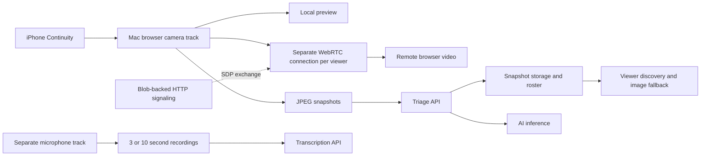

# WebRTC latency investigation and implementation plan

Prepared 2026-09-20. The direct WebRTC implementation is now updated; see
[implementation and deployment notes](webrtc-latency.md). The user confirmed one
viewer and a Vercel deployment maintained by a teammate. An SFU is not needed for
that topology. The findings below describe the original baseline.

## Recommendation

Keep the working iPhone Continuity capture. First separate live-stream availability from AI snapshot processing and measure the real media path. Then address measured publisher load and connection recovery. Adopt a maintained SFU such as LiveKit if the required audience exceeds the direct publisher's sustainable capacity.

The current code already limits each video sender to 2 Mbps, 720p and 30 fps, uses a motion preference, and requests a 50 ms receiver jitter-buffer target. Repeating those settings is not a new fix. Their actual application and resulting delay still need verification.

## Architecture found in this checkout

Signaling establishes the connection; it does not carry the connected WebRTC video. Startup delay, interrupted playback, snapshot refresh delay, transcript delay, and sustained video latency need separate measurements.

| Finding                                                                             | Evidence                                                                                                                                                         | Implication                                                                                                                                                                                                                                                                                                |
| ----------------------------------------------------------------------------------- | ---------------------------------------------------------------------------------------------------------------------------------------------------------------- | ---------------------------------------------------------------------------------------------------------------------------------------------------------------------------------------------------------------------------------------------------------------------------------------------------------- |
| Live viewers depend on fresh AI snapshots.                                          | `features/body-cam/BodyCamWall.tsx:132`, `features/live-track/UnitCard.tsx:79`, `features/body-cam/store.ts:33`, `features/camera-triage/useCameraTriage.ts:370` | A snapshot disappears from discovery after 20 seconds. The next snapshot waits for the previous triage request, then its sampling interval. Slow inference can therefore unmount an otherwise healthy live viewer and force a new handshake. This is a confirmed code path, not yet a reproduced incident. |
| Direct fan-out is bounded by peer connections, not distinct laptops.                | `features/live-video/useLivePublisher.ts:49`, `features/live-video/peer.ts:68`                                                                                   | Four peer connections can each have a 2 Mbps ceiling: up to 8 Mbps of configured video payload budget, plus overhead and other uploads. Actual usage is unknown. Additional viewers receive snapshots.                                                                                                     |
| Basic low-latency settings already exist, but application failures are swallowed.   | `features/live-video/peer.ts:167`, `features/live-video/useLiveWatcher.ts:97`                                                                                    | Inspect actual sender parameters and receiver metrics before adjusting them. A 50 ms jitter-buffer hint is not a 50 ms end-to-end guarantee.                                                                                                                                                               |
| Offers are processed serially; each side waits up to 1.5 seconds for ICE gathering. | `features/live-video/useLivePublisher.ts:124`, `features/live-video/peer.ts:19`                                                                                  | Multiple arrivals can delay first picture. Candidates arriving after SDP is posted are not forwarded.                                                                                                                                                                                                      |
| A transient disconnected state causes immediate teardown.                           | `features/live-video/peer.ts:206`, `features/live-video/useLiveWatcher.ts:59`                                                                                    | A short network interruption can become a five-second retry wait plus a new handshake. Publisher setup lacks an explicit deadline.                                                                                                                                                                         |
| Broadcast is video-only.                                                            | `features/live-video/useLivePublisher.ts:82`, `features/live-video/useLiveWatcher.ts:155`, `features/live-video/LiveVideo.tsx:36`                                | The microphone belongs to a separate transcription path. Audible remote audio would require a live audio track and playback controls.                                                                                                                                                                      |
| Fallback and transcription have intentional batching.                               | `features/camera-triage/CapturePanel.tsx:79`, `features/body-cam/useBodyCamWall.ts:9`, `features/camera-triage/useAudioTranscription.ts:307`                     | Normal dashboard snapshots wait four seconds after a completed request; roster polling adds delay. Transcripts finalize after ten seconds normally or three seconds when urgent, before service processing.                                                                                                |

Every `LiveTile` currently creates its own watcher. Reusing a source in two mounted tiles would duplicate connections, but the audit did not confirm duplicate same-source tiles in the current page composition. Treat sharing as a design safeguard, not an established cause of this incident.

## External implementations inspected

Sources below were inspected on 2026-09-20. Branch URLs may change; pin the chosen package version or source commit before implementation. No external code has been copied.

| Project and source                                                                                                                                     | Pattern to adapt                                                                                                        | Application and limits                                                                                                                                                                 |
| ------------------------------------------------------------------------------------------------------------------------------------------------------ | ----------------------------------------------------------------------------------------------------------------------- | -------------------------------------------------------------------------------------------------------------------------------------------------------------------------------------- |
| [LiveKit client: publishUtils.ts](https://github.com/livekit/client-sdk-js/blob/main/src/room/participant/publishUtils.ts)                             | `computeVideoEncodings`, `encodingsFromPresets`, `getDefaultDegradationPreference` express quality as encoding budgets. | Verify existing settings, then choose bounded profiles. An aggregate budget across our separate peers is our adaptation; it is not a claim about this function's behavior.             |
| [LiveKit client: RemoteVideoTrack.ts](https://github.com/livekit/client-sdk-js/blob/main/src/room/track/RemoteVideoTrack.ts)                           | `updateVisibility` and `updateDimensions` follow viewer visibility and display size.                                    | Send only useful quality to visible tiles, with debouncing. Pausing an HTML video alone does not reduce incoming network traffic.                                                      |
| [LiveKit server: streamallocator.go](https://github.com/livekit/livekit/blob/master/pkg/sfu/streamallocator/streamallocator.go)                        | Transport feedback and `allocateAllTracks` coordinate bandwidth and video layers.                                       | Use the maintained SFU implementation if needed. Its server congestion-control machinery is not a small function to transplant into a browser.                                         |
| [mediasoup demo: RoomClient.js](https://github.com/versatica/mediasoup-demo/blob/v3/app/src/RoomClient.js)                                             | `enableWebcam` produces camera media through a send transport with simulcast/SVC encodings.                             | Publish a bounded set of layers to a server that forwards to viewers. Avoid adding simulcast independently to every direct peer, which can increase publisher work.                    |
| [WebRTC samples: pc1/main.js](https://github.com/webrtc/samples/blob/gh-pages/src/content/peerconnection/pc1/js/main.js)                               | Send candidates as they arrive and apply them with `addIceCandidate`.                                                   | Trickle ICE improves connection establishment and route availability; it does not remove delay in an already flowing stream.                                                           |
| [WebRTC samples: per-frame-callback/main.js](https://github.com/webrtc/samples/blob/gh-pages/src/content/peerconnection/per-frame-callback/js/main.js) | Measure individual rendered frames with `requestVideoFrameCallback`.                                                    | Feature-detect optional timing metadata and check units against the specification. Capture timing may be absent on a one-way connection; retain a physical stopwatch/flash comparison. |

LiveKit client/server are Apache-2.0, mediasoup-demo is ISC, and WebRTC samples are BSD-3-Clause. Preserve applicable notices for any code actually adapted; reuse SDKs where that is more maintainable than copying their internals.

## Implementation sequence

1. **Establish a measurable baseline.** Add a small diagnostic collector beside the peer hooks and rendered video. Sample `getStats()` approximately once per second, using deltas for cumulative counters. Collect actual bitrate/frame rate, sender encode time and packet-send delay, CPU/bandwidth limitation reason, receiver decode/drop/freeze and jitter-buffer metrics, selected route/protocol, RTT, and time to first rendered frame. Report missing fields as unavailable. Label the actual mode: live media, stalled media, connecting, or snapshot fallback. Use [W3C statistics definitions](https://www.w3.org/TR/webrtc-stats/) and [frame metadata definitions](https://wicg.github.io/video-rvfc/); RTT and buffer delay are not substitutes for scene-to-screen delay.

2. **Remove the confirmed AI dependency.** Introduce publisher presence independent of JPEG submission and inference, using shared storage suitable for the deployment's multiple instances. Update camera discovery and viewer mounting to use that presence. A stale snapshot must not terminate healthy media. Track media health through incoming/rendered frames, and show fallback age separately. Preserve bounded AI work and camera stop/track-ended cleanup. Likely touch points: the publisher hook, a presence route/store, `useBodyCamWall`, `BodyCamWall`, and `UnitCard`.

3. **Reduce measured publisher pressure.** Verify the existing sender parameters after applying them and report failures. If fan-out causes congestion, apply a conservative aggregate publisher budget, divide it across active peers, and rebalance on join/leave. Change quality with hysteresis; let browser congestion control operate within those ceilings. If encoding is CPU-limited, compare lower resolution/frame-rate profiles. Preserve the higher-resolution local track for analysis when practical. Add connection sharing only where simultaneous consumers need it; pause unnecessary delivery through transport state, not just video playback.

4. **Make connection recovery bounded and correct.** Use an attempt identifier for each negotiation so late answers cannot attach to newer attempts. Bound signaling requests and publisher setup, prevent duplicate retry timers, clean up failed peers, and count actually connected viewers accurately. Allow a short disconnected grace period while observing media progress. Add a media-stall watchdog so a connected socket is not mistaken for fresh video. Process separate viewer offers concurrently with reserved capacity and per-peer serialization.

5. **Improve setup transport where measurements justify it.** Add trickle candidates, end-of-candidates handling, and candidate queues until the remote description is installed. Continue receiving candidates after the answer. The current Blob mailbox should not receive an unbounded object per candidate; batch bounded candidates if retaining it temporarily. For an SFU, use its signaling. For a retained direct design, select a deployment-compatible realtime signaling service before replacing the mailbox; an in-memory WebSocket map inside ephemeral Next.js handlers is insufficient. Verify actual TURN availability and selected routes on the deployed app. TURN solves reachability, but still relays each direct peer separately.

6. **Choose the scaling architecture from results and required audience.** If required concurrency exceeds what the repaired direct path sustains, integrate LiveKit behind a transport adapter. Reuse the existing Continuity track, publish one bounded set of quality layers, and let the SFU forward per-viewer quality. Keep room presence independent of AI. Add a server-side token endpoint scoped to the existing signed-in identity, source and permitted room. Keep server secrets out of the client. Start with a nearby service region or suitable self-hosted server; an SFU adds a hop, so compare it against healthy direct delivery. Retain a transport feature flag for rollback. Server endpoint/hosting and credentials are deployment inputs still to resolve.

7. **Resolve the audio path explicitly.** If the requirement is hearing the microphone remotely, share the already selected microphone track with the live transport, maintain common stream grouping for A/V, and provide viewer audio enable/mute controls. Define track ownership so closing a viewer cannot stop capture or transcription. If the complaint concerns delayed transcript text, address clip batching/streaming transcription separately; WebRTC video tuning cannot remove its ten-second collection window.

## Verification and completion criteria

- Record before/after behavior with the required one physical viewer laptop. Two- and four-viewer comparisons are optional future capacity checks. Multiple local tabs can validate connection management but do not reproduce another laptop's network or decoding behavior.
- Use the same moving scene and a stopwatch/flash filmed with the receiving display. Where supported, collect estimated capture-to-display metadata too; it may not include the upstream iPhone-to-Mac capture delay.
- Run a sustained ten-minute comparison and record median/p95 delay, freezes, first-picture time, route, actual bitrate and publisher load. A provisional healthy-LAN target is p95 under 500 ms with no accumulating delay; this is an acceptance target to confirm, not a predicted result.
- Stall AI processing beyond 20 seconds and verify that live media survives. Exercise join/leave, transient Wi-Fi interruption, publisher stop/restart, failed relay setup, and a viewer beyond current capacity. Ensure fallback is clearly labeled and cleanup releases slots.
- Verify Chrome/Safari versions actually in use. Compare direct and forced-relay routes where the relay exists; no codec or transport is assumed universally fastest.
- Per repository `AGENTS.md`, run `pnpm run typecheck` after implementation and exercise the running app. Do not author tests or run the test suite while the repository's hackathon rule remains active.

Completion means a before/after measurement on the real capture and viewing devices, with the required viewer count. A successful typecheck or a smooth local preview alone is insufficient.

## Deployment verification inputs

The user confirmed one viewer and a Vercel deployment maintained by a teammate;
the current deliverable is code ready for that deployment. The deployed URL,
publisher and viewer browsers, approximate delay, whether delay grows, and
same-network versus remote viewing remain inputs for the teammate's device
verification. Live microphone sharing is implemented as an explicit opt-in;
transcription timing remains separate.

## Investigation scope

This plan comes from source inspection and primary-source research. No live multi-device latency measurement has been performed. A temporary graphify map covered the nine live-video files (65 nodes, 157 edges); it reported nine dangling endpoint edges and six collapsed relation edges, so direct source inspection was used to verify cross-feature conclusions. The graph is an aid, not runtime evidence.
